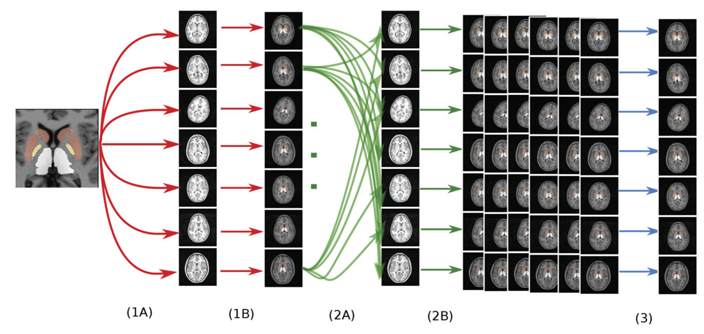

<style>
.remark-code { 
  font-size: 75%;
}

.remark-slide-scaler {
  overflow: scroll;
}

.small {
  font-size: 65%;
}
</style>


```{r setup, include=FALSE}
options(htmltools.dir.version = FALSE)
library(knitr)
opts_chunk$set(dpi=200, fig.height=5.5, fig.width=10)
#opts_chunk$set(tidy.opts=list(width.cutoff=60),tidy=TRUE)
```


# Outline

1. Quick overview of algorithms and datasets used today
1. Anatomy and hierarchies
1. Massively univariate classical statistics
1. Meet Reverend Thomas
1. A simple model
1. A more involved model
1. Diagnostics
1. A complex example (if we have time)
1. ... 
1. Profit?

---

# Following Along

- To follow along with today's session you will need to either:
- run R with `c("knitr", "tidyverse", "forcats", "ggplot2", "broom", "data.tree", "treemap", "rstanarm", "bayesplot", "pheatmap", "ggrepel")` on your laptop
- use R from our singularity container

---

# Get these slides and code

- From a terminal run:

```{r, engine = "bash", eval = FALSE}
git clone https://github.com/Mouse-Imaging-Centre/Scinet-SS-bayesian-neuroimaging-R
cd Scinet-SS-bayesian-neuroimaging-R

## cp in some extra files <use scp if you're working on your own laptop>
cp /bb/scinet/course/ss2018/3_bm/7_mrir/ADNI2_BL_MAGeT_Hippocampus_subfields.csv .
cp /bb/scinet/course/ss2018/3_bm/7_mrir/flathierarchy.Rds .
```
---

# Singularity set up

- First ssh to niagara and set your port to forward

```{r, engine = "bash", eval = FALSE}
ssh -L8787:localhost:<your-port> <you>@niagara.scinet.utoronto.ca
ssh -L<your-port>:localhost:<your-port> tds01
```

- To use the singularity container you will need to set an environment variable with a temporary RStudio password. You will also
  need a temporary directory on SCRATCH, this assumes you don't have a directory with this name already

```{r, engine = "bash", eval = FALSE}
export RSTUDIO_PASSWORD="dont_use_this_fake_password"

mkdir $SCRATCH/tmp
module load singularity
```

---

# Run the container

- Run the container <this command will remain running>

```{r, engine = "bash", eval = FALSE}
module load singularity/2.5.1
singularity exec \
  --bind /bb/scinet/course/ss2018/3_bm/7_mrir/rstudio_auth.sh:/usr/lib/rstudio-server/bin/rstudio_auth.sh \
  --bind $SCRATCH/tmp:/tmp \
  /bb/scinet/course/ss2018/3_bm/7_mrir/RMINC-develop-2018-06-13-6793fefb8a5a.img \
  rserver \
  --auth-none 0 \
  --auth-pam-helper-path rstudio_auth.sh \
  --www-port <your-port>
```

- Then navigate to localhost:8787 in your browser, use your scinet username and `$RSTUDIO_PASSWORD$` 

---
class: middle
# The dataset: ADNI

* baseline scans from ADNI2
* multi-site initiative to study Alzheimer's and Mild Cognitive Impairment

With much gratitude to Nikhil Bhagwat of the CoBrA Lab (PI: Chakravarty) for providing us with processed data.

---

# MAGeT - the algorithm



Chakravarty MM, Steadman P, van Eede MC, Calcott RD, Gu V, Shaw P, Raznahan A, Collins DL, Lerch JP. Performing label-fusion-based segmentation using multiple automatically generated templates. Hum Brain Mapp. 2013 Oct;34(10):2635–54.

---

# MAGeT - the atlas


```{r, echo=F, out.height="400px"}
knitr::include_graphics("hippoatlas.png")
```

.small[
Pipitone J, Park MTM, Winterburn J, Lett TA, Lerch JP, Pruessner JC, Lepage M, Voineskos AN, Chakravarty MM, Alzheimer’s Disease Neuroimaging Initiative. Multi-atlas segmentation of the whole hippocampus and subfields using multiple automatically generated templates. Neuroimage. 2014 Nov 1;101:494–512.

Winterburn JL, Pruessner JC, Chavez S, Schira MM, Lobaugh NJ, Voineskos AN, Chakravarty MM. A novel in vivo atlas of human hippocampal subfields using high-resolution 3 T magnetic resonance imaging. Neuroimage. 2013 Jul 1;74:254–65.
]
---

# Load the data

Read in the processed files

```{r}
suppressMessages(library(tidyverse))
adni <- read.csv("ADNI2_BL_MAGeT_Hippocampus_subfields.csv")
names(adni)
```


---
#Reorganize the diagnosis label

```{r}
library(forcats)
adni <- adni %>% 
  mutate(DX_bl=fct_relevel(DX_bl, 
                           "CN", "SMC", "EMCI", "LMCI", "AD"))
```

---

# Data organization

Make the dataframe long rather than wide

```{r}
adniLong <- adni %>% 
  select(-X) %>% 
    gather(structure, volume, L_CA1:R_Mam)
adniLong %>% 
  select(PTID, DX_bl, structure, volume) %>% sample_n(5)
```


---

# A quick look at the data

```{r, fig.height=5.5}
library(ggplot2)
ggplot(adniLong) + aes(x=DX_bl, y=AGE) + geom_boxplot()
```

---

# A quick look at hippocampal volume

```{r, tidy=FALSE, fig.height=5}
adniLong %>% group_by(PTID) %>% 
  summarize(DX=DX_bl[1], GENDER=PTGENDER[1], HPC=sum(volume)) %>%
  ggplot() + aes(DX, HPC, colour=GENDER) + geom_boxplot()
```

---

# Classic Statistics

1. Decide on model
1. Apply model to every ROI/voxel separately
1. Widen confidence intervals to account for multiple comparisons

---

# map for looping over structures

```{r}
library(broom)
adniLong %>%
  split(.$structure) %>%
  map(~lm(volume ~ AGE+PTGENDER+DX_bl, .)) %>%
  map_dfr(tidy, .id='roi') %>% head(14)
```
---

# better overview

```{r}
rTable <- adniLong %>%
  split(.$structure) %>%
  map(~lm(volume ~ AGE+PTGENDER+DX_bl, .)) %>%
  map_dfr(tidy, .id='roi') %>% 
  filter(startsWith(term, "DX")) %>%
  select(roi, term, statistic) %>%
  spread(term, statistic) 
```

---
# better overview
```{r}
rTable
```

---
# better overview
```{r}
DT::datatable(rTable %>% remove_rownames() %>% 
  column_to_rownames("roi") %>% round(2), options=list(pageLength=7))
```

---

# Interpretting these results

- After fitting our models we're left with:

1. coefficient estimates
1. t-statistics
1. p-values

- We know if our model assumptions are satisfied our t-statistics
  have a known distribution. 
- From this distribution we can figure out the probability of t-statistics
  as large or larger than the one we observed (p-value)

---

# Frequentist Null Hypothesis Testing

- To form conclusions in frequentism we typically lean on null hypothesis testing.
- Null hypotheses are parameter values for your model you'd like to disprove
- If your statistics (and more extreme statistics) would be very unlikely given your null model
  you reject the null hypothesis, and conclude that the null hypothesis is not correct.
- Choosing a threshold for this probability (e.g. 0.05) and rejecting when your p-value
  is below the threshold gives you a fixed probability of making a "Type I" error, 
  which conveniently is equal to your threshold.
- So if we reject all p-values when they are below 0.05 we have a 5% chance of
  rejecting when the null model is in fact true.
- If this is confusing, you're not alone, this is very hard to wrap your mind around.

---

# Dealing with Many Tests

- If you're testing a lot of hypotheses, a 5% chance of making a mistake adds up
- After 14 tests you have a better than a 50/50 chance of having made at least one mistake
- How do we control for this?
- Two main approaches Family-Wise Error Rate (FWER) control and False-Discovery Rate (FDR) control.

---

# FWER

- In family-wise error rate control, we try to limit the chance we will at least one
  type I error.
- Quite conservative, so in neuroimaging we tend to use False Discovery Rate control.

---

# FDR

- Instead of trying to control our chances of making at least one mistake, let's try to control the
  fraction of mistakes we make.
- To do this we employ the Benjamini-Hochberg procedure.
- The Benjamini-Hochberg procedure turns our p-values in q-values. Rejecting all q-values below some
  threshold controls the expected number of mistakes.
- For example if we reject all hypotheses with q < 0.05, we expect about 5% of our results to be
  false discoveries (type I errors). 
- If we have 100's or more tests we can accept a few mistakes in the interest of finding the
  important results.

---

# multiple comparisons - omnibus FDR

```{r}
pTable <- adniLong %>%
  split(.$structure) %>%
  map(~lm(volume ~ AGE+PTGENDER+DX_bl, .)) %>%
  map_dfr(tidy, .id='roi') %>% 
  filter(startsWith(term, "DX")) %>%
  select(roi, term, p.value) %>%
  spread(term, p.value) %>%
  remove_rownames() %>%
  column_to_rownames("roi") %>%
  as.matrix()
qTable <- pTable
qTable[,] <- p.adjust(pTable, 'fdr')
```

---

# multiple comparisons - omnibus FDR

```{r}
qTable
```

---

# Hippocampal anatomical hierarchy

Setting up a simple hierarchy, dividing the hippocampus in grey matter and tracts.

1. Hippocampal Formation
    1. Grey Matter
        1. CA1
        1. CA2/CA3
        1. CA4/DG
        1. subiculum
        1. stratum
        1. Mammilary bodies
    1. White Matter
        1. Alveus
        1. Fimbria
        1. Fornix

---

# Hippocampal anatomical hierarchy

```{r}
library(data.tree)
hpc <- Node$new("HPC")
gm <- hpc$AddChild("GM")
ca1 <- gm$AddChild("CA1")
lca1 <- ca1$AddChild("left CA1")
lca1$volumes <- adni$L_CA1
rca1 <- ca1$AddChild("right CA1")
rca1$volumes <- adni$R_CA1
ca23 <- gm$AddChild("CA2CA3")
lca23 <- ca23$AddChild("left CA2CA3")
lca23$volumes <- adni$L_CA2CA3
rca23 <- ca23$AddChild("right CA2CA3")
rca23$volumes <- adni$R_CA2CA3
ca4 <- gm$AddChild("CA4DG")
lca4 <- ca4$AddChild("left CA4DG")
lca4$volumes <- adni$L_CA4DG
rca4 <- ca4$AddChild("right CA4DG")
rca4$volumes <- adni$R_CA4DG
subiculum <- gm$AddChild("subiculum")
lsubiculum <- subiculum$AddChild("left subiculum")
lsubiculum$volumes <- adni$L_subiculum
rsubiculum <- subiculum$AddChild("right subiculum")
rsubiculum$volumes <- adni$R_subiculum
stratum <- gm$AddChild("stratum")
lstratum <- stratum$AddChild("left stratum")
lstratum$volumes <- adni$L_stratum
rstratum <- stratum$AddChild("right stratum")
rstratum$volumes <- adni$R_stratum
mam <- gm$AddChild("Mammillary bodies")
lmam <- mam$AddChild("left Mammillary bodies")
lmam$volumes <- adni$L_Mam
rmam <- mam$AddChild("right Mammillary bodies")
rmam$volumes <- adni$R_Mam
wm <- hpc$AddChild("WM")
alveus <- wm$AddChild("Alveus")
lalveus <- alveus$AddChild("left Alveus")
lalveus$volumes <- adni$L_Alv
ralveus <- alveus$AddChild("right Alveus")
ralveus$volumes <- adni$R_Alv
fimbria <- wm$AddChild("Fimbria")
lfimbria <- fimbria$AddChild("left Fimbria")
lfimbria$volumes <- adni$L_Fimb
rfimbria <- fimbria$AddChild("right Fimbria")
rfimbria$volumes <- adni$R_Fimb
fornix <- wm$AddChild("Fornix")
lfornix <- fornix$AddChild("left Fornix")
lfornix$volumes <- adni$L_Fornix
rfornix <- fornix$AddChild("right Fornix")
rfornix$volumes <- adni$R_Fornix
```

---

# Hippocampal anatomical hierarchy

```{r}
hpc
```

---

# Hippocampal anatomical hierarchy

```{r, fig.height=6, dpi=72}
SetGraphStyle(hpc, rankdir="LR")
plot(hpc)
```

---
# Aggregate up the tree

```{r}
hpc$Do(function(x){
  x$volumes <- Aggregate(x, "volumes", rowSums)
}, traversal="post-order", filterFun=isNotLeaf)

hpc$Do(function(x) {
  x$meanVolume <- mean(x$volumes)
})
```


---

# Tree graph

```{r, fig.height=4}
library(treemap)
ToDataFrameTable(hpc, "pathString", "meanVolume", "name") %>% 
  mutate(path=strsplit(pathString, "/"), 
         struct=map_chr(path, ~ .x[3]), 
         tissue=map_chr(path, ~ .x[2])) %>% 
  select(struct, tissue, name, meanVolume) %>% 
  treemap(index=c("tissue", "struct"), vSize="meanVolume")
```


---
# Statistics on the tree

```{r}
hpc$Do(function(x){
  adni$volumes <- x$volumes
  x$stats <- 
    lm(volumes ~ AGE+PTGENDER+DX_bl, adni) %>%
    tidy() %>%
    filter(startsWith(term, "DX")) %>%
    select(term, estimate, statistic, p.value)
})
```
---

# Statistics on the tree

```{r}
print(hpc, AD=function(x) 
  x$stats %>% filter(term=="DX_blAD") %>% select(statistic) )
```

---

# Statistics on the tree

```{r}
print(hpc, AD=function(x) 
  x$stats %>% filter(term=="DX_blAD") %>% 
    select(statistic),
  filterFun=isNotLeaf )
```


---

# Statistics on the tree

```{r, fig.height=3}
hpc$Do(function(x){
  x$ad <- -log10(x$stats %>% filter(term=="DX_blAD") %>% 
                   select(p.value))
})

ToDataFrameTable(hpc, "pathString", "meanVolume", "name", "ad") %>% 
  mutate(path=strsplit(pathString, "/"), 
         struct=map_chr(path, ~ .x[3]), 
         tissue=map_chr(path, ~ .x[2])) %>% 
  select(struct, tissue, name, meanVolume, ad) %>% 
  treemap(index=c("tissue", "struct"), vSize="meanVolume", 
    vColor="ad", type="value")
```


---
class: center

# And now for Bayesianism!

---
# Why Bayesian Statistics?

Have you ever...

1. Been confused about what a p-value means?
1. Been frustrated that a difference in significance doesn't mean a significant difference?
1. Known some values for a parameter are impossible but been unable to use that to your advantage?
1. Wanted to ask more interesting questions than whether or not a parameter is or isn't zero?
1. Wanted to use information from the literature to improve your estimates?

---

# Why Bayesian Statistics?

Have you ever...

1. Been confused about what a p-value means?
1. Been frustrated that a difference in significance doesn't mean a significant difference?
1. Known some values for a parameter are impossible but been unable to use that to your advantage?
1. Wanted to ask more interesting questions than whether or not a parameter is or isn't zero?
1. Wanted to use information from the literature to improve your estimates?

Then Bayesian statistics might be right for you!

---

## How you ask?

1. **De-emphasize binary descisions.**
  Bayesians avoid null hypothesis tests, instead focusing on estimating their parameters of 
  interest, and reporting their uncertainty.
1. **Posterior Distributions**
  Bayesian analyses produce a distribution of possible parameter values (the posterior), that
  can be used to ask many interesting questions about values. E.g. what is the probability the
  effect in the hippocampus is larger than the effect in the anterior cingulate cortex.
1. **Prior Information**
  Bayesian analyses can use prior information. Bayesian analysis requires an *a priori* assessment
  of how likely certain parameters are. This can be vague (uninformative) or can precise (informative)
  and steer your analysis away from nonsensical results.

---

class: center
# Meet The Reverend

Reverend Thomas Bayes


---
class: middle

## Bayes' Theorem

- Bayes noticed this useful property for the probabilities for two events "A" and "B"

$$ \color{red}{P(A | B)} = \frac{{\color{blue}{P(B | A)}\color{orange}{P(A)}}}{\color{magenta}{P(B)}} $$
- $\color{red}{P(A|B)}$: The probability of A given that B happened
- $\color{blue}{P(B|A)}$: The probability of B given that A happened
- $\color{orange}{P(A)}$: The probability of A
- $\color{magenta}{P(B)}$: the probability of B

- Bayes did this in the context of the binomial distribution

---
class: middle
# But who's that behind him!

---
class: center

# It's Pierre-Simon Laplace


---

## Bayesian Statistics

- Laplace generalized Bayes Theorem into it's modern form. While working on sex-ratios in French births.
- Start with some parameters $\theta$
- Collect some data $D$
- And deduce the probability of different values of $\theta$ given that you observed $D$
- Key difference between Bayesianism and Frequentism is that view that $\theta$ has an associated
  probability distribution. In frequentism $\theta$ is an unknown constant.

---

$$ P(\theta) $$

---

class: middle

# Bayes' Theorem Redux

$$ \color{red}{P(\theta | D)} = \frac{{\color{blue}{P(D | \theta)}\color{orange}{P(\theta)}}}{\color{magenta}{\int P(D | \theta)P(\theta)d\theta}} $$

**Posterior**: $\color{red}{P(\theta|D)}$: 

the probability of our parameters given our data

**Likelihood**: $\color{blue}{P(D|\theta)}$

The probability of our data given our parameters

**Prior**: $\color{orange}{P(\theta)}$

The probability of our parameters before we saw the data 

**Normalizing Constant**: $\color{magenta}{\int P(D | \theta)P(\theta)d\theta}$

The probability of the data averaged over all possible parameter sets


---

class: middle

# Bayes' Theorem Redux

$$ \color{red}{P(\theta | D)} \propto \color{blue}{P(D | \theta)}\color{orange}{P(\theta)}$$

**Posterior**: $\color{red}{P(\theta|D)}$: 

the probability of our parameters given our data

**Likelihood**: $\color{blue}{P(D|\theta)}$

The probability of our data given our parameters

**Prior**: $\color{orange}{P(\theta)}$

The probability of our parameters before we saw the data 

---

class: middle

# Bayes' Theorem Redux

$$ \color{red}{P(\theta | D)} \propto \color{orange}{P(\theta)}\color{blue}{P(D | \theta)}$$

**Posterior**: $\color{red}{P(\theta|D)}$: 

the probability of our parameters given our data

**Prior**: $\color{orange}{P(\theta)}$

The probability of our parameters before we saw the data 

**Likelihood**: $\color{blue}{P(D|\theta)}$

The probability of our data given our parameters

**Pardon the re-ordering**

---
class: middle

# Posterior

$\color{red}{P(\theta|D)}$

- The goal of bayesian statistics
- The posterior is probability distribution over parameters.
- Depends on the data we observed.
- Can be used to answer interesting questions. For
example how likely is an effect between two biologically meaninful boundaries.

---
class: middle

# Prior

$\color{orange}{P(\theta)}$

- This is what we knew before the experiment. 
- The prior is also a probability distribution over parameters.
- Doesn't depend on the data we saw.
- Gives a probability for any value the parameters could take.

---
class: middle

# Likelihood

$\color{blue}{P(D | \theta)}$

- This is how probable our data is given a hypothetical parameter set
- The likelihood is a probability distribution over data (not parameters)
- Is still a function of parameters.

---

# In words

The <font color="red">probability of parameters given our data</font> is proportional to <font color="orange">how probable we
thought they were before</font> adjusted by <font color="blue">how well they agree with the data we saw</font>.


---

# A first example

- Let's revisit linear modelling but this time from a bayesian stand-point.

$$ \textbf{y} = X\mathbf{\beta} + \mathbf{\epsilon} $$ 

We'll make our probabilistic views explicit

$$ \mathbf{\epsilon} \sim \mathbb{N}(0, \sigma) $$

$\epsilon$ is normally distributed with some unknown variance $\sigma$

---


# Frequentist interpretation

- In frequentism $\mathbf{\beta}$ is some fixed value.
- We can estimate standard errors for $\beta$ and get p-values
  (likelihoods) that each component of $\mathbf{\beta}$ is zero.
  
# Bayesian interpretation

- In bayesianism $\mathbf{\beta}$ is a random variable that we're trying
  to learn about.
- In order to do this we have specify our prior belief about $\mathbf{\beta}$
- If we say we know nothing about $\mathbf{\beta}$, we get identical estimates
  to frequentism


---

# Simulate some data

```{r, fig.height = 4}
set.seed(20180613)
age <- rnorm(100)
brain_volume <- 3 * age + rnorm(100)
plot(age, brain_volume)
```

---

# Fit a bayesian linear model

- For this we'll use the package `rstanarm`


```{r}
suppressMessages(library(rstanarm))
ex <- data.frame(brain_volume = brain_volume, age = age)
bl <- stan_glm(brain_volume ~ age, data = ex,
                prior = normal(0, 5))
```

---

# How'd we do

```{r}
bl
```

---

# How does `lm` do?

```{r}
lmod <- lm(brain_volume ~ age, data = ex)
summary(lmod)
```

---

# Side-By-Side

```{r}
coef(bl)
coef(lmod)
```

---

# Let's look at the posterior

```{r, fig.height = 4}
suppressPackageStartupMessages(library(bayesplot))
mcmc_areas(as.matrix(bl), pars = "age")
```

---

# What's happening here?

- `rstanarm` is creating a posterior for us, but how?
- in most bayesian textbooks this is shown first analytically for simple models.
  *this is not what stan does*
- Stan *approximates* the posterior using samples
- Samples are generated with markov-chain monte carlo (MCMC)

---

# The posterior revisited

```{r}
bl_post <- as.matrix(bl)

str(bl_post[,"age"])
summary(bl_post[,"age"])
```

---

# With real data now

- Let's look at the effect of diagnosis on CA1 volume

```{r}
scale_vec <- function(x) (x - mean(x)) / sd(x)
ca1_ex <-
  adni %>%
  mutate(volume = scale_vec(L_CA1 + R_CA1))
```

Scaling here helps improve model fitting, an allows you to interpret parameters in terms of whole sample standard deviations.

---

# Model

$$\text{volume} = \beta_{D}D + \epsilon$$
- We're not going to estimate an intercept for this model, fitting instead the mean volume for each diagnosis
- in a R formula it will look like

`volume ~ -1 + DX_bl`

- The -1 removes the intercept

---

#Fit

```{r}
invisible(
  capture.output({
    ca1_mod <- stan_glm(volume ~ -1 + DX_bl, data = ca1_ex)
  }))

ca1_mod
```

---

So we see that the effect of each diagnosis has on CA1 volume. Let's visualize the posterior for these effects

```{r, fig.height = 5}
mcmc_areas(as.matrix(ca1_mod), regex_pars = "DX.*")
```

---

```{r}
table(ca1_ex$DX_bl)
```

So we can see some signs that the posterior width is driven in part by sample size, nice.

---

# Posterior Magic

First let's extract the posterior

```{r}
ca1_post <- as.matrix(ca1_mod)
```

What do we think the probability is that AD patients have smaller CA1s than controls? Easy to answer with the posterior!

```{r}
mean(ca1_post[,"DX_blCN"] > ca1_post[,"DX_blAD"])
```

So we're pretty sure about this. 

---

# But how big is the difference?

```{r, fig.height = 4}
mcmc_areas(ca1_post[,"DX_blCN", drop = FALSE] - ca1_post[,"DX_blAD"])
```

---

# Looking at many structures

---
# Data preparation

```{r}
hpc$Do(function(x){
  x$normVolumes <- scale(x$volumes)
})

hpcSym <- Clone(hpc)
Prune(hpcSym, isNotLeaf)
data <- hpcSym$Get("normVolumes", filterFun=isLeaf)
colnames(data) <- hpcSym$Get("name", filterFun = isLeaf)
adniLongNorm <- adni %>% 
  mutate(AGE=AGE/10) %>% 
  select(PTID:DX_bl) %>% 
  cbind(data) %>% 
  # sample_n(100) %>% # to make it not last an ice-age
  gather(structure, volume, CA1:Fornix) 
```

---
# The model

```{r, eval=FALSE}
flathierarchy <- stan_lmer(
  volume ~ AGE+PTGENDER+DX_bl + (1|PTID) + 
           (AGE+PTGENDER+DX_bl|structure), 
  adniLongNorm , chains=3, cores=3, adapt_delta = 0.99)
```

The model takes a while to run, unless you specified sample_n to a relatively small number. So just load the output from an earlier, saved run instead.

```{r}
flathierarchy <- readRDS("flathierarchy.Rds")
```

---
# The model
```{r, eval=FALSE}
flathierarchy <- stan_lmer(
  volume ~ AGE+PTGENDER+DX_bl + (1|PTID) +
           (AGE+PTGENDER+DX_bl|structure), 
  adniLongNorm , chains=3, cores=3, adapt_delta = 0.99)
```

What is this model doing?

* volume ~ AGE + PTGENDER + DX_bl -> the same model we saw before
* (1|PTID) -> allow for variation across individuals; i.e. those with a larger CA1 are also likely to have a larger DG
* (AGE+PTGENDER+DX_bl|structure) -> repeat of the model, but now grouped by structure.

--

Huh?

--

* the main effects (first part) are across all structures
* for each structure, the deviation from the main effect is estimated

---

# The magic of pooling

How do we work with multiple brain structures at the same time? By pooling. Here's what that could mean:

--

**Complete pooling:** we ignore that we have multiple structures, and sum them. I.e. a single model across overall hippocampal volume.

--

**No pooling:** we compute a separate model for each structure. What happens in CA1 has no bearing on what happens in CA2/CA3. This is what we do with our massively univariate models. You need to control for multiple comparisons by widening your confidence intervals.

--

**Partial pooling:** what happens in CA1 will _somewhat_ influence what happens in CA2/CA3, in that the model will share information across structures. These are our hierarchical Bayesian models.

--

Partial pooling, once more: the prior for each structure is the pooled estimated of all structures. The stronger the data for each structure (i.e. the likelihood), the less the estimate will shrink towards the pooled estimates. And the pooled estimates are themselves determined from the data.

--

And since all structures share information, you need not control for multiple comparisons. Shrinkage replaces widening of confidence intervals.

---
# Covariance priors

So if the prior for each structure is estimated from the data, we don't need a prior? Not quite - we have to decide how pooling happens.

--

This is our model from before:

$y = \alpha + X\beta + Zb + \epsilon$

* where $X$ is the matrix of predictors for the main effect, AGE+PTGENDER+DX_bl in our model.
* and where $Z$ is the matrix that encodes deviation in the predictors across groups, or structures in our case, which we specified as (AGE+PTGENDER+DX_bl|structure) and (1|PTID).

--

The likelihood is thus

$y \sim \mathcal{N} (\alpha + X\beta + Zb, \sigma^2 I)$

* intercept and coefficients common across structures
* deviations in intercepts and coefficients that vary across structures

---
# Covariance priors

Back to the likelihood:

$y \sim \mathcal{N} (\alpha + X\beta + Zb, \sigma^2 I)$

* intercept and coefficients common across structures
* deviations in intercepts and coefficients that vary across structures

--

We now need priors on parameters. We maintain the simple assumption that $b \sim \mathcal{N} (0,\Sigma)$ - i.e. the deviation for each structure is centred at zero with some variance.

--

But now we need to state our prior beliefs about $\Sigma$ in addition to $\alpha$, $\beta$, and $\sigma$. 

--

Our prior for varying slopes and intercepts is a "zero-mean random vector following a multivariate Gaussian distribution with an unknown covariance matrix to be estimated"

--

More detail here: [http://mc-stan.org/rstanarm/articles/glmer.html]

---
# Taking a peek

```{r}
summary(flathierarchy, digits=3)
```

---
# Quick diagnostics: Rhat

```{r, fig.height=4}
mcmc_rhat_hist(rhat(flathierarchy))
```

---
# More diagnostics: trace plots

We'll need data in matrix form for this and many future ops
```{r}
flathierarchym <- as.matrix(flathierarchy)
```

```{r, fig.height=5}
mcmc_trace(flathierarchym[,1:7])
```

---
# The main effects

```{r, fig.height=6, fig.width=10}
mcmc_intervals(flathierarchym[,1:7])
```

---
# Effect across structures
```{r, fig.height=6, fig.width=10}
mcmc_intervals(flathierarchym, 
  pars="DX_blAD", regex_pars = 'DX_blAD structure')
```

---
# Effect across structures
```{r, fig.height=6, fig.width=10}
mcmc_areas_ridges(flathierarchym, 
  pars="DX_blAD", regex_pars = 'DX_blAD structure')
```

---
# Summed effects

```{r, fig.height=5.5, fig.width=10}
vars <- colnames(flathierarchym)
ADsamples <- flathierarchym[,grep('DX_blAD structure', vars)]
mcmc_areas_ridges(ADsamples + flathierarchym[,"DX_blAD"])
```

---
# Probability calculations

What is the probability that CA1 was more affected than CA2/CA3 in AD?

```{r}
mean(flathierarchym[,'b[DX_blAD structure:CA1]'] < 
       flathierarchym[,'b[DX_blAD structure:CA2CA3]'])
```

Not very likely

```{r}
quantile(flathierarchym[,'b[DX_blAD structure:CA1]'] - 
       flathierarchym[,'b[DX_blAD structure:CA2CA3]'])
```

---
# Probability calculations
What is the probability that the subiculum was more affected than CA1 in AD?

```{r}
mean(flathierarchym[,'b[DX_blAD structure:subiculum]'] < 
       flathierarchym[,'b[DX_blAD structure:CA1]'])
```

Almost certainly

```{r}
quantile(flathierarchym[,'b[DX_blAD structure:subiculum]'] - 
       flathierarchym[,'b[DX_blAD structure:CA1]'])
```

---
# All pairs of probabilities

```{r}
ADvars <- grep("DX_blAD structure", vars)
probcomps <- matrix(nrow=length(ADvars), ncol=length(ADvars))
for (i in 1:length(ADvars)) {
  for (j in 1:length(ADvars)) {
    probcomps[i,j] <- mean(flathierarchym[,ADvars[i]] < 
                             flathierarchym[,ADvars[j]])
  }
}
```

```{r}
pnames <- sub('.+structure:(.+)\\]', '\\1', 
              colnames(flathierarchym[,ADvars]))
rownames(probcomps) <- pnames
colnames(probcomps) <- pnames
```

---
# All pairs of probabilities

```{r, fig.height=5.5}
library(pheatmap)
pheatmap(probcomps, display_numbers=T)
```


---

# Estimating shrinkage

First, compute the least squares estimates
```{r}
lmEstimates <- adniLongNorm %>%
  split(.$structure) %>%
  map(~lm(volume ~ AGE+PTGENDER+DX_bl, .)) %>%
  map_dfr(tidy, .id='roi') %>%
  filter(term == "DX_blAD") %>%
  select(roi, estimate)
```

---

# Estimating shrinkage

Next, compute the medians from the Hierarchical Bayesian model

```{r}
sweptADsamples <- flathierarchym[,ADvars] + flathierarchym[,"DX_blAD"]
lmAndBayes <- sweptADsamples %>% 
  as_data_frame %>% 
  gather(term, value) %>% 
  group_by(term) %>% 
  summarize(median=median(value)) %>% 
  mutate(term=sub('.+structure:(.+)\\]', '\\1', term)) %>% 
  mutate(term=sub('_', ' ', term)) %>%
  inner_join(lmEstimates, by=c("term" = "roi")) 
```


---

# Estimating Shrinkage

```{r}
lmAndBayes %>% mutate(diff=abs(median - estimate))
```

---

# Estimating Shrinkage

```{r, fig.height=4}
library(ggrepel)
ggplot(lmAndBayes) + 
  aes(median, estimate) + 
  geom_point() + 
  geom_abline(aes(intercept=0, slope=1)) + 
  geom_text_repel(aes(label=term)) + 
  xlab("Hierarchical Bayesian") + 
  ylab("Least squares")
```

---
# Estimating shrinkage across all terms

```{r}
structvars <- grep('b.+structure', vars, value = T)
mainterms <- sub('b\\[(.+) str.+', '\\1', structvars)

structswmain <- flathierarchym[,structvars] + flathierarchym[,mainterms]

bOut <- structswmain %>% 
  as.data.frame %>% 
  gather(mterm, value) %>%
  group_by(mterm) %>% 
  summarize(median=median(value)) %>%
  mutate(roi = sub('.+structure:(.+)\\]', '\\1', mterm),
         roi = sub('_', ' ', roi),
         term = sub('b\\[(.+) str.+', '\\1', mterm)) %>%
  select(median, roi, term)


lOut <- adniLongNorm %>%
  split(.$structure) %>%
  map(~lm(volume ~ AGE+PTGENDER+DX_bl, .)) %>%
  map_dfr(tidy, .id='roi') %>%
  select(estimate, roi, term)

blOut <- inner_join(bOut, lOut) 
```

---

# Estimating shrinkage across all terms

```{r}
ggplot(blOut) + 
  aes(median, estimate, colour=term) + 
  geom_point() +
  geom_abline(aes(intercept=0, slope=1))
```

---

# Estimating shrinkage across all terms

```{r, fig.height=5}
ggplot(blOut) + 
  aes(median, estimate, colour=roi) + 
  geom_point() +
  geom_abline(aes(intercept=0, slope=1)) +
  xlab("Hierarchical bayes") +
  ylab("Least squares") +
  facet_wrap(~term, scales="free")
```

---

# What about the MCI groups?

Remember, nothing survived FDR comparisons ...

```{r}
mcmc_intervals(structswmain, regex_pars="EMCI")
```

---

# And LMCI

```{r}
mcmc_intervals(structswmain, regex_pars="LMCI")
```

---
# A reminder about LMCI FDR

```{r}
hpcSym$Do(function(x){
  adni$volume <- x$normVolumes
  x$stats <- tidy(lm(volume ~ AGE+PTGENDER+DX_bl, adni))
  x$LMCI <- x$stats %>% filter(term=="DX_blLMCI") %>% select(p.value)
})
round(p.adjust(
  hpcSym$Get("LMCI", filterFun = isLeaf), 'fdr'), 
  3)
```


---

# Installing RMINC

- RMINC provides many convenience functions for working with hierarchically structured volume data. 
- The lead developers are responsive on github and willing to offer help if needed.
- Full install guide can be found at https://github.com/Mouse-Imaging-Centre/RMINC/blob/master/INSTALL

---

#Linux install:

1. Get the minc-toolkit-v2 (https://bic-mni.github.io/)
1. Source the configure script `source /opt/minc/1.9.16/minc-toolkit-config.sh` or where-ever your minc-toolkit version was installed
1. Set your `MINC_PATH` environment variable `export MINC_PATH=/opt/minc/1.9.16/`
1. Open an R session
1. Install `devtools` if you have not already `install.packages("devtools")`
1. Install `RMINC` with 
```{r, eval = FALSE}
devtools::install_github("Mouse-Imaging-Centre/RMINC", 
  dependencies = c("Depends", "Imports", "LinkingTo",
                   "Suggests","Enhances"))

#Mac Install

Mac install is very similar, however fortran libraries are necessary, and so you will likely need the
package manager [brew](https://brew.sh/). From there you will need to run `brew install gcc`

Then find a directory that looks like:

```{r, engine = "bash", eval = FALSE}
/usr/local/Cellar/gcc/7.*.*/lib/gcc/7
```

this needs to be added to your R build variables (makevars)

```{r, eval = FALSE, engine = "bash"}
mkdir $HOME/.R/ ## Ignore error here
touch $HOME/.R/Makevars
echo 'FLIBS=-L/usr/local/Cellar/gcc/7.1.0/lib/gcc/7' >> \
  $HOME/.R/Makevars
```

If this succeeds, go ahead and follow the linux instructions.


